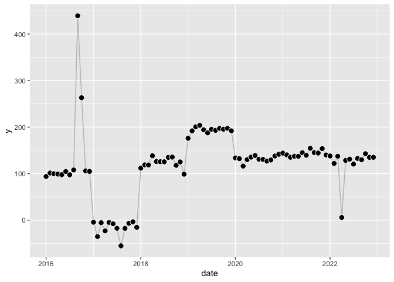
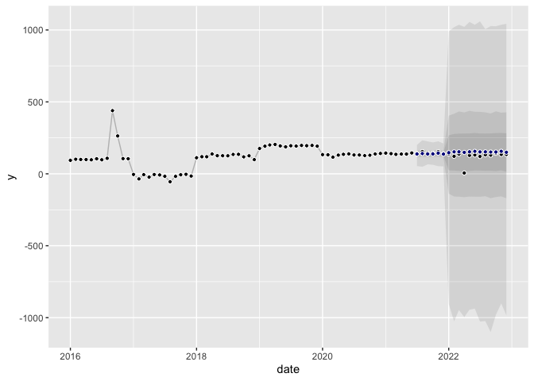
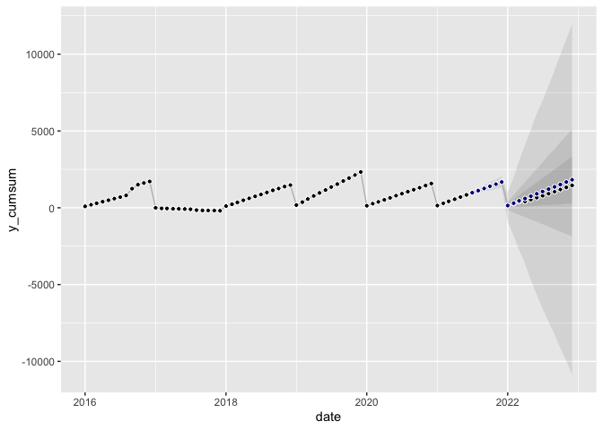

<!-- README.md is generated from README.Rmd. Please edit that file -->

# panning

<!-- badges: start -->

<!-- badges: end -->

The goal of panning is to provide a strong benchmark univariate forecast
model for monthly data that is robust against outliers, handles shifts
at year change, and fits trend and seasonality. The
`panning::forecast()` function creates forecasts in the form of sample
paths.

## Installation

You can install the development version of panning from
[GitHub](https://github.com/) with:

``` r
# install.packages("devtools")
devtools::install_github("timradtke/panning")
```

## Example

``` r
library(panning)

library(ggplot2)
library(dplyr)
#> 
#> Attaching package: 'dplyr'
#> The following objects are masked from 'package:stats':
#> 
#>     filter, lag
#> The following objects are masked from 'package:base':
#> 
#>     intersect, setdiff, setequal, union
set.seed(117)
```

The package comes with a function `synthesize()` that can be used to
create time series representing the kind of use case that can be
covered.

``` r
dates <- seq(as.Date("2016-01-01"), as.Date("2022-12-01"), by = "month")
y <- synthesize(dates = dates)

df <- data.frame(date = dates, y = y)
ggplot(df, aes(x = date, y = y)) +
  geom_line(color = "grey") +
  geom_point(pch = 21, color = "white", fill = "black", size = 3)
```



``` r
fit <- rmf(
  dates = dates[1:(length(dates) - 18)],
  y = y[1:(length(y) - 18)],
  use_seasonality = TRUE
  )
#> GAMLSS-RS iteration 1: Global Deviance = 108.6844 
#> GAMLSS-RS iteration 2: Global Deviance = 66.4897 
#> GAMLSS-RS iteration 3: Global Deviance = 63.8686 
#> GAMLSS-RS iteration 4: Global Deviance = 63.5438 
#> GAMLSS-RS iteration 5: Global Deviance = 63.479 
#> GAMLSS-RS iteration 6: Global Deviance = 63.4593 
#> GAMLSS-RS iteration 7: Global Deviance = 63.4543 
#> GAMLSS-RS iteration 8: Global Deviance = 63.4525 
#> GAMLSS-RS iteration 9: Global Deviance = 63.4517
```

``` r
df_sample_paths <- panning(object = fit, h = 18, n_samples = 5000)
```

``` r
df_forecast_monthly <- df_sample_paths %>%
  dplyr::group_by(date) %>%
  dplyr::summarize(
    q01 = quantile(y, 0.01),
    q05 = quantile(y, 0.05),
    q13 = quantile(y, 0.13),
    q50 = quantile(y, 0.50),
    q87 = quantile(y, 0.87),
    q95 = quantile(y, 0.95),
    q99 = quantile(y, 0.99),
  )

ggplot(mapping = aes(x = date)) +
  geom_ribbon(aes(ymin = q01, ymax = q99), alpha = 0.1, 
              data = df_forecast_monthly) +
  geom_ribbon(aes(ymin = q05, ymax = q95), alpha = 0.1, 
              data = df_forecast_monthly) +
  geom_ribbon(aes(ymin = q13, ymax = q87), alpha = 0.1, 
              data = df_forecast_monthly) +
  geom_line(aes(y = y), color = "grey", data = df) +
  geom_point(aes(y = y), color = "white", fill = "black", pch = 21, data = df) +
  geom_point(aes(y = q50), color = "white", fill = "darkblue", pch = 21, 
             data = df_forecast_monthly)
```



``` r
df_cumsum <- df %>%
  dplyr::group_by(year = format(date, "%Y")) %>%
  dplyr::mutate(y_cumsum = cumsum(y)) %>%
  dplyr::ungroup()

df_forecast_ytg <- df_sample_paths %>%
  dplyr::group_by(sample_index, year = format(date, "%Y")) %>%
  dplyr::mutate(y_cumsum = cumsum(y)) %>%
  dplyr::ungroup()

df_forecast_ytg[df_forecast_ytg$year == min(df_forecast_ytg$year),]$y_cumsum <- df_forecast_ytg[df_forecast_ytg$year == min(df_forecast_ytg$year),]$y_cumsum +
  df_cumsum$y_cumsum[df_cumsum$date == seq(from = min(df_forecast_ytg$date), by = "-1 months", length.out = 2)[2]]

df_forecast_ytg_summarized <- df_forecast_ytg %>%
  dplyr::group_by(date) %>%
  dplyr::summarize(
    q01 = quantile(y_cumsum, 0.01),
    q05 = quantile(y_cumsum, 0.05),
    q13 = quantile(y_cumsum, 0.13),
    q50 = quantile(y_cumsum, 0.50),
    q87 = quantile(y_cumsum, 0.87),
    q95 = quantile(y_cumsum, 0.95),
    q99 = quantile(y_cumsum, 0.99),
  ) %>%
  dplyr::ungroup()

ggplot(mapping = aes(x = date)) +
  geom_ribbon(aes(ymin = q01, ymax = q99), alpha = 0.1, data = df_forecast_ytg_summarized) +
  geom_ribbon(aes(ymin = q05, ymax = q95), alpha = 0.1, data = df_forecast_ytg_summarized) +
  geom_ribbon(aes(ymin = q13, ymax = q87), alpha = 0.1, data = df_forecast_ytg_summarized) +
  geom_line(aes(y = y_cumsum), color = "grey", data = df_cumsum) +
  geom_point(aes(y = y_cumsum), color = "white", fill = "black", pch = 21, data = df_cumsum) +
  geom_point(aes(y = q50), color = "white", fill = "darkblue", pch = 21, data = df_forecast_ytg_summarized)
```


